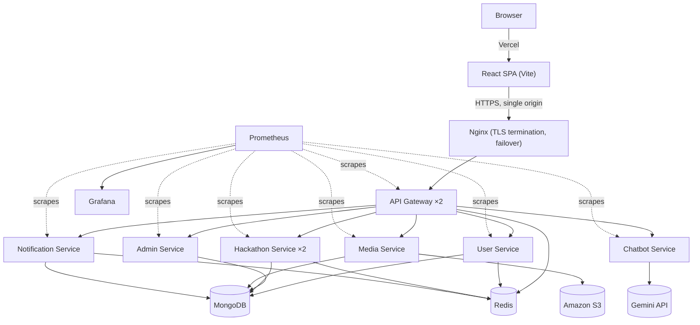

<p align="center">
  
</p>

<h1 align="center">HackSprint</h1>
<h3 align="center">A Distributed Hackathon Platform</h3>

<p align="center">
  Built at IIT Jodhpur — students discover and register for hackathons, form teams,
  submit projects, and get judged; organizers run events end-to-end from creation to results.
</p>

---

## 1. What This Is

HackSprint is a hackathon-hosting platform with two sides: **students** browse and register for hackathons (solo or in a team formed via a shareable invite code), submit their project (GitHub repo, live demo, documents) within a fixed window, and see results on a public leaderboard. **Admins/organizers** create and configure hackathons (subject to platform-admin approval), assign judges, review submissions, and score them. Both sides get email, in-app, and browser push notifications for things like deadline reminders and team activity. Beyond events, students have a **community layer** — a People directory with public profiles, connection requests and direct messages — and every visitor can reach the team through a **Contact** page and a **Feedback** form whose submissions land in a controller inbox on the admin dashboard. A built-in assistant (Byte, backed by Gemini) answers platform questions and streams its replies.

Alongside that original submission-based format, HackSprint also supports **on-spot events** — in-person, bracket/tournament-style competitions (drone combat, robotics, similar physical competitions) with no project submission at all. Admins pair teams into matches round by round and enter scores live; standings update automatically and are always publicly visible, and teams get reminded (in-app, email, and push) as their scheduled match time approaches.

It's deliberately built as a **distributed system** rather than a single monolith — six independently deployable backend services behind one API gateway (which verifies tokens and rate-limits through Redis), a separately deployed frontend, containerized with Docker with the busiest components running as two copies behind Nginx, monitored with Prometheus/Grafana, and shipped via GitHub Actions. Part of the point of this project is the engineering exercise of building and operating that kind of system, not just the product on top of it.

---

## 2. Architecture



The frontend and backend deploy independently: the frontend is a static build hosted on **Vercel**, the backend runs as a set of Docker containers on a single **AWS EC2** instance behind Nginx, shipped by **GitHub Actions** on every push to `main`. Neither side knows or cares how the other is hosted — they only agree on the API Gateway's public URL.

This is the 60-second version. The full architectural reasoning — why microservices, the request-flow sequence, data-layer choices, and known tradeoffs — is in [`backend/docs/architecture.md`](backend/docs/architecture.md).

---

## 3. Repository Structure

```
HackSprint
├── backend/
│   ├── api-gateway/          Single public entry point — routing, CORS, token check, Redis-backed rate limiting
│   ├── user-service/         Student login (Google OAuth + One Tap), JWT + refresh tokens, profiles, people directory, connections, messages
│   ├── admin-service/        Admin login, organiser verification, controller tools, contact + feedback inbox
│   ├── hackathon-service/    Hackathons (submission-based + on-spot/bracket), registrations, teams, judging, discussions
│   ├── media-service/        File uploads → Amazon S3
│   ├── notification-service/ In-app notifications + transactional email + browser push (BullMQ)
│   ├── chatbot-service/      FAQ chatbot (Google Gemini) — stateless, no database, no user data access
│   ├── nginx/                Reverse proxy, HTTPS termination, failover between gateway copies
│   ├── prometheus/           Scrape config
│   ├── grafana/              Provisioned datasource + dashboard
│   ├── docker-compose.yml        Development stack (one copy of each service)
│   ├── docker-compose.prod.yml   Production stack (2 copies of gateway + hackathon-service, health checks)
│   └── docs/                 Detailed architecture, services, API gateway, and CI/CD docs
└── frontend/
    └── hack-sprint/          React + Vite SPA — see its own README for frontend-specific detail
```

---

## 4. Tech Stack

| Layer | Technology |
|---|---|
| Frontend | React 19, Vite, Tailwind CSS, TanStack Query, Zustand, React Router |
| Backend | Node.js + Express, one process per service |
| Database | MongoDB (primary, shared instance), Redis (cache, rate-limit counters, job locks, queues) |
| File Storage | Amazon S3 (the media service reads its AWS access key from its environment file) |
| Auth | Google OAuth (popup code flow and One Tap) + JWT access/refresh tokens; student and admin sessions are independent; the gateway verifies tokens and forwards identity |
| Async work | BullMQ/Redis (transactional email, browser push), `node-cron` (deadline + on-spot match reminders) |
| AI | Google Gemini API — scoped to a stateless platform-FAQ chatbot (streamed replies, Markdown), no access to user accounts/data |
| Reverse proxy | Nginx (HTTPS via Let's Encrypt, retries across gateway copies) |
| Containerization | Docker + Docker Compose |
| CI/CD | GitHub Actions (backend → EC2, in-place container replacement), Vercel (frontend) |
| Observability | Prometheus + Grafana |

---

## 5. Local Development

**Backend** (from `backend/`):
```bash
cp <service>/.env.example <service>/.env          # per service, for running with npm run dev
cp <service>/.env.example <service>/.env.docker   # per service, for docker compose
docker compose up -d --build
```
`docker compose` brings up MongoDB, Redis, the gateway and all six services (the gateway is published on port 5000). To run a service directly instead, `cd <service> && npm install && npm run dev`.

| Service | Port |
|---|---|
| api-gateway | 5000 |
| user-service | 5001 |
| hackathon-service | 5002 |
| media-service | 5003 |
| notification-service | 5004 |
| chatbot-service | 5005 |
| admin-service | 5006 |

Each service needs its own env file; the exact requirements are enforced by each service's startup validation, not duplicated here. A few values must **agree across services**:

- `SECRET_KEY` — the JWT signing secret. Tokens issued by the user and admin services are verified by the gateway and by the other services.
- `INTERNAL_SERVICE_SECRET` — service-to-service calls and the gateway's trusted identity headers.
- `FRONTEND_URL` — the allowed CORS origin.

The gateway also needs the address of every service (`USER_SERVICE_URL`, `ADMIN_SERVICE_URL`, `HACKATHON_SERVICE_URL`, `MEDIA_SERVICE_URL`, `NOTIFICATION_SERVICE_URL`, `CHATBOT_SERVICE_URL`) and, optionally, `REDIS_URL` for shared rate-limit counters. Other per-service needs: S3 credentials for `media-service`; a Brevo API key and VAPID keys for `notification-service`; `GEMINI_API_KEY` and `GEMINI_MODEL` for `chatbot-service`; Google OAuth client id and secret for `user-service` and `admin-service`. The Google client's "Authorized JavaScript origins" must include your frontend origin for One Tap to appear.

See [`backend/docs/services.md`](backend/docs/services.md) for what each service owns and [`backend/docs/observability.md`](backend/docs/observability.md) for the Docker and deployment details.

**Frontend** (from `frontend/hack-sprint/`):
```bash
npm install
npm run dev
```
Requires `VITE_API_URL` pointing at your local gateway (`http://localhost:5000` by default) and `VITE_GOOGLE_CLIENT_ID` — see [`frontend/hack-sprint/README.md`](frontend/hack-sprint/README.md) and its `.env.example`.

---


## 6. Documentation

This README is the entry point. Everything below goes deeper on one specific part of the system:

| Doc | Covers |
|---|---|
| [`backend/docs/architecture.md`](backend/docs/architecture.md) | Full system architecture, request flow, data layer, tradeoffs, planned work |
| [`backend/docs/architecture.excalidraw`](backend/docs/architecture.excalidraw) | The whole system as one editable diagram (open at excalidraw.com or in the VS Code Excalidraw extension) |
| [`backend/docs/services.md`](backend/docs/services.md) | What each of the six services (plus the gateway) owns and is responsible for |
| [`backend/docs/api-gateway.md`](backend/docs/api-gateway.md) | Gateway routing, identity forwarding, rate limiting, configuration |
| [`backend/docs/observability.md`](backend/docs/observability.md) | Docker, replicas and health checks, CI/CD pipeline, Prometheus/Grafana access |
| [`frontend/hack-sprint/README.md`](frontend/hack-sprint/README.md) | Frontend folder structure, routing, API client, state management, Docker |

---

## 7. Contributing

```bash
git clone https://github.com/devlup-labs/HackSprint.git
cd HackSprint
git checkout -b feature/my-feature
# make changes
git commit -m "Add my feature"
git push origin feature/my-feature
```

Open a pull request against `main`. If you're touching backend routing, data ownership, or infrastructure, check the relevant doc in `backend/docs/` first — several design decisions there are deliberate tradeoffs, not oversights.

---

## 8. License

See [`LICENSE`](LICENSE).

<p align="center">HackSprint · DevLup Labs · IIT Jodhpur</p>
