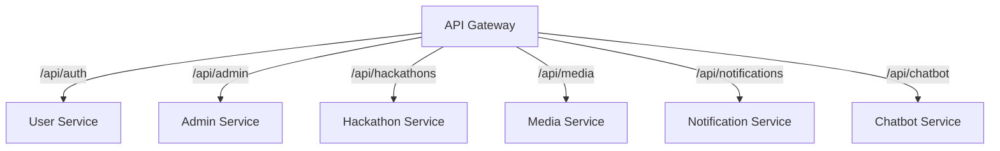

# HackSprint — API Gateway

**Status:** Living document
**Scope:** API Gateway service
**Audience:** Engineers contributing to or operating HackSprint

See also: [`architecture.md`](./architecture.md) for how the gateway fits into the platform as a whole.

---

## 1. Overview

The API Gateway is the single public entry point for every backend request in HackSprint. Clients never communicate directly with internal microservices — every request, regardless of which service it's ultimately destined for, enters through the same path.


The gateway contains no business logic and owns no database. Its job is routing plus a small set of cross-cutting concerns that would otherwise be repeated in every service: security headers, CORS, compression, logging, metrics, **access-token verification**, and **rate limiting**. The mandate is kept narrow on purpose — the more a gateway takes on, the more it becomes a shared point of coupling and risk for every service behind it.

---

## 2. Current Responsibilities

The gateway performs:

- routing and reverse proxying (`http-proxy-middleware`)
- CORS (explicit origin allow-list), security headers (Helmet), response compression
- request logging (Morgan), request ID generation, Prometheus metrics (`/metrics`)
- **identity forwarding** — verifies the bearer token once and tells the downstream service who the caller is (Section 6)
- **rate limiting** — per IP, per signed-in account, and for media uploads, with counters in Redis when configured (Section 7)
- a health endpoint (`GET /health`) and a status endpoint (`GET /`)

What it does **not** do: it does not run role-based access control (services still decide what an admin or controller may do), does not query MongoDB, stores no data, and does no response caching. Redis is used only for rate-limit counters.

---

## 3. Project Structure

```
src/
  config/
    env.js
    redis.js
    sentry.js
  middlewares/
    identity.middleware.js
    rateLimit.middleware.js
    requestId.middleware.js
    notFound.middleware.js
    error.middleware.js
  metrics/
  routes/
    user.proxy.js
    admin.proxy.js
    hackathon.proxy.js
    media.proxy.js
    notification.proxy.js
    chatbot.proxy.js
  index.js
```

`config/` holds the downstream service addresses and the optional Redis connection. `middlewares/` holds the Express middleware described in Section 5. `routes/` has one proxy file per downstream service, each forwarding one URL prefix to one service. `index.js` wires the middleware stack, mounts the proxies and starts the server.

---

## 4. Routing



The proxies mount with Express `app.use`, so the matched prefix is stripped before forwarding: `/api/admin/profile` reaches the Admin Service as `/profile`, and `/api/auth/messages/:id` reaches the User Service as `/messages/:id`. The URL prefix `/api/auth` is kept for the User Service (it began life as the Auth Service) so the frontend's endpoints did not change when the service was renamed.

| Prefix | Service | Examples |
|---|---|---|
| `/api/auth` | user-service | student login, profile, people directory, connections, messages |
| `/api/admin` | admin-service | admin login (`/auth/*`), profile, verification, controller tools, contact + feedback (`/public/*`) |
| `/api/hackathons` | hackathon-service | events, registration, teams, submissions, judging (`/platform/admin/*`), discussions |
| `/api/media` | media-service | file uploads |
| `/api/notifications` | notification-service | in-app notifications, push subscriptions |
| `/api/chatbot` | chatbot-service | `/chat` and the streaming `/chat/stream` |

Each proxy owns exactly one prefix and knows nothing about the others; there is no shared route table to keep in sync. A downstream failure returns a JSON `503` naming the unavailable service.

---

## 5. Request Flow and Middleware


Helmet sets standard security headers. CORS follows, using a small explicit origin list (the configured `FRONTEND_URL`, the deployed site and the local Vite dev server), never a wildcard. Compression reduces payload size. The metrics middleware and request ID middleware then record the request. Morgan writes the access log. Identity and the rate limiters (Sections 6 and 7) run before any proxy, so a request that is over its limit is refused without ever reaching a service. The media proxy has one extra, stricter limiter in front of it. The gateway does not parse request bodies — it streams them through — so large uploads are not buffered in the gateway.

---

## 6. Identity Forwarding

The gateway verifies the access token once and passes the result on, so services don't each have to.

1. Any `x-gateway-secret`, `x-user-claims` and `x-user-type` headers sent **by the client** are deleted first. A client cannot forge them.
2. If the request carries a valid, unexpired `Bearer` access token, the gateway sets `x-gateway-secret` (the shared `INTERNAL_SERVICE_SECRET`), `x-user-type` (`student` or `admin`) and `x-user-claims` (the token's payload, base64url-encoded).
3. Refresh tokens are not access tokens and never produce an identity.
4. The middleware **never rejects**. A missing, expired or malformed token just means "no identity", and the service answers `401` itself, so public routes, token refresh and logout behave exactly as before.

Each service has a small `gatewayIdentity` helper. It trusts the forwarded claims only when `x-gateway-secret` matches its own `INTERNAL_SERVICE_SECRET` (constant-time comparison). The auth middlewares in user-service, admin-service, hackathon-service, notification-service and media-service use the forwarded claims when present and **fall back to verifying the bearer token themselves** otherwise.

That fallback is deliberate and temporary. The gateway needs two environment values (`SECRET_KEY` and `INTERNAL_SERVICE_SECRET`) before it can do this; without them it simply proxies, and services keep working exactly as before. Once the gateway is the only way in and those values are set everywhere, the fallback branch in each service's auth middleware can be removed.

Services still make their own authorization decisions: the admin middleware loads the admin record to check `isActive` and the controller flag, and ownership checks (who may edit which event) stay in the owning service.

---

## 7. Rate Limiting

Three limiters run in the gateway, all returning `429` with a JSON body:

| Limiter | Key | Window | Limit (production / development) |
|---|---|---|---|
| IP | client IP | 15 min | 500 / 2000 |
| User | signed-in account id (skipped for anonymous requests) | 1 min | 240 / 2000 |
| Media | account id, else IP | 1 min | 60 / 600 |

Counters live in Redis (`rate-limit-redis`, key prefix `rl:gw:`) when `REDIS_URL` is set, so limits are shared across gateway copies and survive restarts. If `REDIS_URL` is unset, or Redis becomes unreachable, the limiters fall back to per-process memory or **fail open** — requests are let through rather than the API going down because of its counter store.

Individual services add tighter limits of their own where a request is expensive or abusable: login and signup endpoints, the public contact and feedback forms (8 per hour per connection, plus a per-address daily cap), and the chatbot (15 messages per minute, since each is a billed LLM call).

---

## 8. Request ID, Metrics and Health

Every request gets an identifier on `req.requestId` and an `x-request-id` header, reused if the caller already sent one, so a request can be followed through log lines. This is log correlation, not distributed tracing.

`GET /metrics` exposes Prometheus metrics (`prom-client`). `GET /health` returns status and uptime and is used by the Docker health check; `GET /` returns a short status message. Because the gateway runs as more than one copy, Prometheus discovers every copy through DNS (see [`observability.md`](./observability.md)).

---

## 9. Error Handling

A global error middleware, last in the chain, catches unhandled errors. Proxy failures are handled in each proxy's `error` hook, which returns `503` with the name of the unavailable service. Unknown routes get a JSON `404` from the not-found middleware.

---

## 10. Configuration

| Variable | Purpose |
|---|---|
| `PORT`, `NODE_ENV`, `FRONTEND_URL` | process and CORS settings |
| `USER_SERVICE_URL` | user-service address (`AUTH_SERVICE_URL` is still accepted as the old name) |
| `ADMIN_SERVICE_URL` | admin-service address (defaults to `http://localhost:5006`) |
| `HACKATHON_SERVICE_URL`, `MEDIA_SERVICE_URL`, `NOTIFICATION_SERVICE_URL`, `CHATBOT_SERVICE_URL` | the other services |
| `SECRET_KEY` | JWT signing secret, identical to the services' |
| `INTERNAL_SERVICE_SECRET` | shared secret that marks forwarded identity headers as trusted |
| `REDIS_URL` | shared rate-limit counters (optional) |
| `SENTRY_DSN` | error monitoring (optional) |

---

## 11. Availability

In production two copies of the gateway run side by side. Nginx spreads requests across them and retries a request on the other copy if one fails, so restarting or losing one copy is invisible to users. Nothing in the gateway holds per-process state that matters: rate-limit counters are in Redis and tokens are stateless, so any copy can serve any request. Details are in [`architecture.md`](./architecture.md) Section 6.

---

## 12. Current Limitations

- Service-level token verification still exists as a fallback (Section 6), so token checking is centralized but not yet exclusive.
- The gateway does not enforce roles; services do.
- No response caching, circuit breaking or automatic retry of failed proxy calls.
- Both gateway copies run on the same host, so a host failure still takes the platform down.
- All communication is synchronous HTTP.

---

## 13. Future Improvements

Planned but **not implemented**:

- removing the per-service token fallback once the gateway is the only entry point
- role and route-level authorization rules at the gateway
- response caching for cacheable requests
- circuit breaker and retry policies for downstream calls
- API versioning and request validation
- distributed tracing built on the existing request ID
- a managed load balancer in front of gateway copies on more than one host

---

## 14. Tradeoffs

Routing everything through one gateway keeps downstream services simpler (none implement their own CORS, headers or compression), centralizes policy in one codebase, and gives one consistent vantage point for logs, request IDs and metrics. The cost is an extra network hop and a component every request depends on. Running two copies behind Nginx removes the single-process failure mode; the single-host failure mode remains and is an accepted tradeoff at the current scale (see [`architecture.md`](./architecture.md)).
