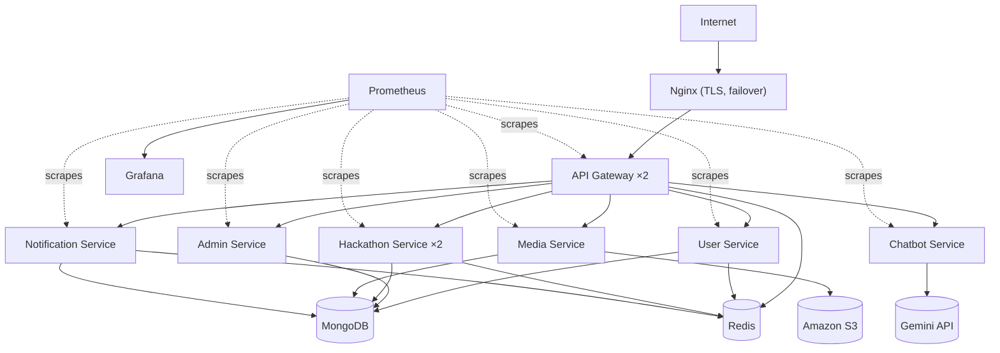
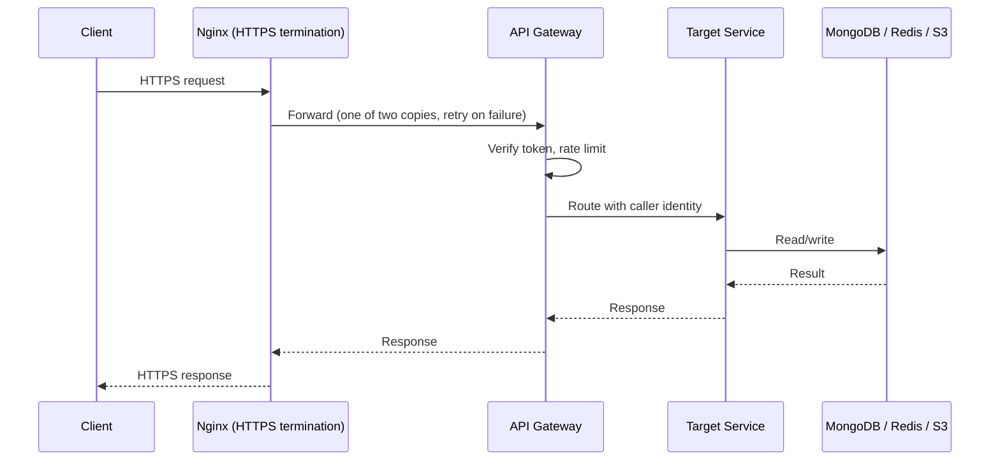
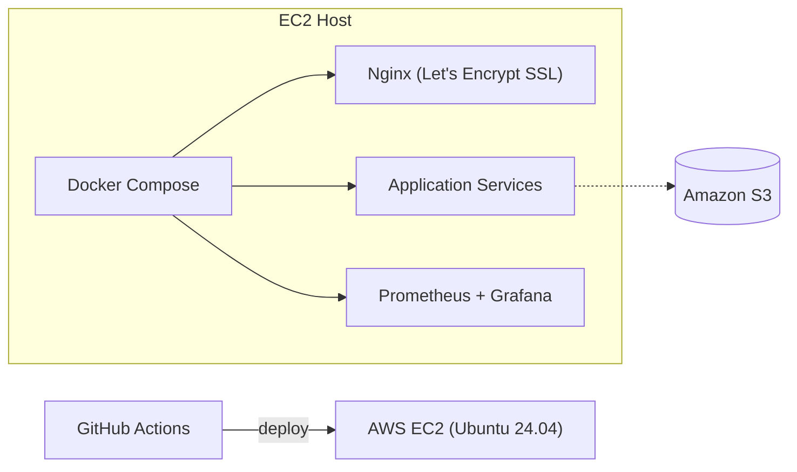
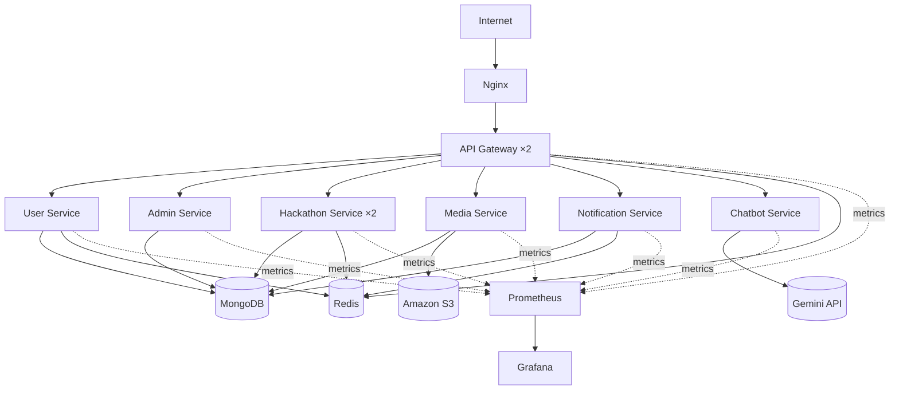

# HackSprint — System Architecture

**Status:** Living document
**Scope:** Backend platform architecture
**Audience:** Engineers contributing to or operating HackSprint

---

## 1. Overview

HackSprint is a hackathon and developer community platform built on a microservices architecture. Students discover and register for events, form teams, submit projects, message each other and get judged; organisers create and run events; platform controllers moderate. Files live on Amazon S3, and notifications reach users in-app, by email and as browser push.

Unlike a typical CRUD application, HackSprint is deliberately structured as a backend-focused distributed system. The platform exists as much to be an engineering exercise as it does to be a product: a vehicle for building real experience with service boundaries, inter-service communication, caching, containerized deployment, availability and observability. That framing matters throughout this document — several choices favor learning value and operational realism over the shortest path to a feature.

This document describes the system as it is currently implemented. Section 9 separates out work that is planned but not yet built.

---

## 2. Current Architecture

A request enters through a single public edge, is terminated by Nginx, passes the API Gateway (which verifies the caller's token and applies rate limits), and is handled by one of six independently deployable services.

The six services are the **User Service** (students, profiles, community, messaging), the **Admin Service** (organisers, verification, controller tools, contact inbox), the **Hackathon Service** (events and everything about participation), the **Media Service**, the **Notification Service** and the **Chatbot Service**. Each is its own Express application with its own deployment lifecycle, and each is reachable only through the gateway — no service is exposed to the internet. Responsibilities per service are in [`services.md`](./services.md).

Inter-service communication is synchronous HTTP, with two asynchronous exceptions, both on BullMQ/Redis queues: transactional email, and push delivery inside the Notification Service. A sending service never waits on either.

**Who verifies what.** The gateway verifies the bearer token once and forwards the caller's identity to the service in headers that only the gateway can set (see [`api-gateway.md`](./api-gateway.md) Section 6). Services still decide what the caller may do: whether an admin is active, whether they are a controller, who owns an event. During the transition each service also keeps its own token check as a fallback, so a gateway without the shared secrets configured degrades to the previous behaviour instead of failing.

**Two kinds of account.** Students and admins are independent identities with separate login routes, separate token pairs and separate refresh cookies. A browser holds one at a time. Student tokens carry `_id`; admin tokens carry `id`. Google sign-in works for both, either through the popup code flow or through One Tap, where the browser hands over a Google-signed ID token and no popup opens.

**Event formats.** The Hackathon Service supports two formats behind one `Hackathon` schema, distinguished by `eventFormat`: the original **submission-based** flow (registration, submission, judging/voting), and **on-spot** events for in-person bracket competitions. On-spot events reuse the phase mechanism with a `MATCH_ROUND` phase type and add one collection, `Match`. Standings are computed on read and are always public. Neither format needed a new service or a change to the request path.

**Scheduled work.** Two `node-cron` jobs run in the Hackathon Service, both calling the Notification Service like any other caller: an hourly sweep for registration/submission phases closing soon (reminders at 24 and 12 hours out), and a 5-minute sweep for on-spot matches (reminders at 1 hour and 15 minutes out). They are in-process timers, not a job queue. Because the Hackathon Service runs as two copies, each sweep takes a Redis lock so only one copy executes it per tick.

**Notifications.** Every in-app notification the platform creates is also delivered as a browser push (Web Push/VAPID). Subscriptions are stored per user and device; sends are queued on a separate `push` queue so a slow push provider can never delay notification creation.

**Chatbot.** The Chatbot Service holds no database connection by design. It answers platform FAQ questions through Gemini with a fixed system prompt, streams replies to the widget over server-sent events, and never sees any user's account data.

**Messaging.** Direct messages between connected students are polled (no websocket layer). The client saves each outgoing message in a local outbox with a client-generated ID, sends it in the background, and retries on failure; a unique `(sender, clientId)` index on the server turns a retry of an already-saved message into a harmless no-op, so a dropped connection can neither lose nor duplicate a message.

Related reading: [`api-gateway.md`](./api-gateway.md), [`services.md`](./services.md), [`observability.md`](./observability.md).

The whole system is also drawn as a single editable diagram, [`architecture.excalidraw`](./architecture.excalidraw): requirements, API design, high-level design, deployment, storage choices, scaling and consistency, and the key request flows with their schemas.

---

## 3. Request Flow

Nginx is the only component that speaks TLS to the outside world; everything behind it uses plain HTTP on the internal Docker network. That keeps certificate management in one place while each service still sits on an isolated bridge network.

---

## 4. Data Layer

### 4.1 MongoDB — Primary Datastore

MongoDB is the system of record: accounts, events, submissions, messages, media metadata, notifications and the contact inbox. A document store fits a domain of nested, heterogeneous records and a schema that is still evolving.

It is a **single shared instance**, and the User, Admin and Hackathon services use the same database. Logical ownership is still divided by domain (see [`services.md`](./services.md) Section 9), and a handful of schemas are duplicated across services and must be kept in sync by hand.

### 4.2 Redis

Redis is shared infrastructure with several distinct jobs:

- **Caching** — event lists, event details and results (Hackathon Service, invalidated on every change); public profiles and People-directory lists (User Service). Profiles use write-through: every profile change stores the fresh value, so readers never see a cold miss after an edit. Cache access fails open: if Redis is down, reads go to MongoDB.
- **Rate-limit counters** — the gateway's limiters (Redis-backed so limits hold across gateway copies; fail open if Redis drops).
- **Job locks** — keeps the reminder sweeps from running twice when the Hackathon Service has two copies.
- **Queues** — the BullMQ `email` and `push` queues.

### 4.3 Amazon S3 — Object Storage

S3 stores uploads and other large assets, keeping the database small and focused on queryable data. The Media Service authenticates to S3 with an AWS access key supplied through its environment file (`AWS_ACCESS_KEY_ID` / `AWS_SECRET_ACCESS_KEY`, from the `MEDIA_ENV` secret); it refuses to start without them. Switching to an IAM role attached to the instance, so no key exists at all, is listed in Section 9.

---

## 5. Why Microservices

The decision to build HackSprint as independent services, rather than one monolith, was deliberate and carries real tradeoffs (Section 10).

**Independent deployment.** Each service builds, tests and deploys on its own schedule; changing how notifications are sent does not require redeploying login.

**Service isolation.** Each owns its code and responsibilities. The Media Service knows about S3; it does not need to know how tokens are issued. The student and organiser sides are separate services with separate login, so an issue in one does not touch the other's credentials.

**Scalability.** A service under load can be scaled on its own — the gateway and Hackathon Service already run as two copies — without scaling the platform.

**Fault isolation.** A failure in one service does not crash another. If the Notification Service fails, users can still sign in and submit.

**Maintainability.** Smaller codebases are easier for a small team to hold in their heads.

**Future expansion.** A new capability means a new service behind the gateway, not edits to a shared monolith.

This is not a claim that microservices beat a monolith at this size; Section 10 addresses that. The choice is also intentionally pedagogical.

---

## 6. Deployment and Availability

HackSprint runs on a single AWS EC2 instance (Ubuntu 24.04). Docker Compose defines every service plus Nginx, Redis, MongoDB, Prometheus and Grafana as one unit. Nginx terminates HTTPS with a Let's Encrypt certificate. GitHub Actions deploys on every push to `main`. The Media Service reaches S3 with an access key from its environment file.

**Availability on one host.** The gateway and the Hackathon Service — the two busiest components — run as **two copies each** (`deploy.replicas: 2` in `docker-compose.prod.yml`):

- Docker's DNS returns every copy's address; Nginx's `gateway` upstream spreads requests across them and **retries a request on the other copy** if one errors or times out, so losing or restarting a copy is invisible to users. Nginx reloads periodically, which re-resolves the address list after a redeploy.
- Every service has a Docker **health check** against its `/health` endpoint, and Nginx starts only once a gateway copy is healthy.
- Nothing that matters is held in one process's memory: rate-limit counters, caches and locks are in Redis and tokens are stateless, so any copy can serve any request.
- The deploy workflow no longer runs a full `down` before `up`. It builds first, then replaces containers in place (`up -d --remove-orphans`), so copies of a scaled service are swapped one at a time and Nginx always has a healthy one to use.
- Prometheus discovers every copy of the scaled services through DNS service discovery.

This protects against a crashed or restarting process and gives near-zero-downtime deploys. It does **not** protect against the whole host failing; that needs a second host, a managed load balancer, and MongoDB and Redis moved off the box (Section 9).

**Images.** Each service builds from its own Dockerfile (`node:22-alpine`, `npm ci --omit=dev`). `.dockerignore` excludes `.env*`, so no environment file — including `.env.docker` — is baked into an image; configuration reaches containers at runtime through Compose `env_file`.

**Observability.** Prometheus scrapes each service's `/metrics`; Grafana visualizes them. Both are bound to the host's loopback interface only (see [`observability.md`](./observability.md)).

---

## 7. Current Implementation Summary

Seven Express applications — API Gateway, User, Admin, Hackathon, Media, Notification, Chatbot — run under Docker Compose on one EC2 host, with the gateway and Hackathon Service doubled. The gateway verifies tokens, forwards identity, and rate-limits through Redis. Services communicate over synchronous HTTP, with email and push delivery queued on BullMQ/Redis. MongoDB is shared; Redis provides caching, counters, locks and queues; S3 holds files. Nginx terminates HTTPS and fails over between gateway copies. Prometheus and Grafana provide metrics. The Media Service's S3 access key comes from its environment file.

---

## 8. Component Diagram

---

## 9. Future Improvements

Planned but **not implemented**:

- **Removing the per-service token check** — the gateway already verifies tokens and forwards identity; the services' own verification remains as a fallback until the gateway is the only way in.
- **Pagination for admin lists** — the controller's all-admins and all-events lists and per-event participant lists still return everything.
- **A search service** — event search currently filters a cached list; a dedicated index makes sense if the catalogue or search load grows.
- **A second host and managed load balancer** — plus MongoDB (replica set) and Redis (persistence) moved off the single instance, so a host failure no longer takes the platform down.
- **Dedicated databases per service** — and an event-driven path for the data that hackathon-service reads from user/admin data.
- **Circuit breakers and retry policies** for service-to-service calls.
- **Distributed tracing** and **centralized logging** (request IDs exist, trace propagation does not).
- **Alertmanager** on top of the existing Prometheus metrics.
- **An IAM role for S3 access** — the Media Service currently needs a static access key in its environment file; an instance role would remove the key entirely.
- **Automated MongoDB backups.**
- **Kubernetes and service discovery**, once the deployment outgrows one host.
- **Background queues for further workloads**, such as media processing.

---

## 10. Tradeoffs

**Advantages.** Each service can be understood, tested and deployed independently. Fault isolation means a bug in one service degrades a slice of functionality, not the whole platform. The infrastructure — Compose, Nginx, Prometheus/Grafana, GitHub Actions, health checks, replicated entry points — mirrors patterns used in real production systems, which fits the project's learning goals.

**Disadvantages.** Synchronous HTTP between services means a slow downstream service slows the request that depends on it; there is no circuit breaker yet, and only email and push have moved onto a queue. Seven services on one EC2 host share a single point of physical failure; running two copies of the busiest ones protects against process failures, not host failure. The shared MongoDB instance couples data availability across services, and duplicated schemas must be kept in sync by hand. More services also mean more containers to monitor and more surface area to operate than a monolith for the same feature set.

**Why this is appropriate at current scale.** Today's traffic and team size do not need Kubernetes, service discovery or multi-host orchestration — they would add operational complexity without a matching benefit yet. One host running Compose is enough capacity and gives the clearest view of how each piece behaves. The availability work in Section 6 was chosen because it buys the most resilience for the least added machinery.
