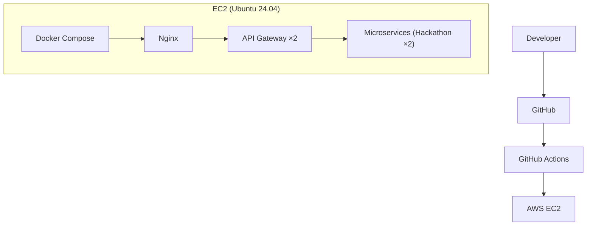
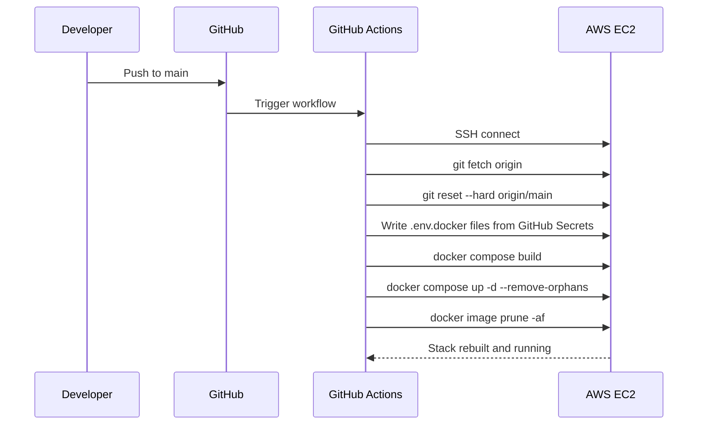

# HackSprint — Infrastructure & Observability

**Status:** Living document
**Scope:** Production deployment, CI/CD, and monitoring
**Audience:** Engineers contributing to or operating HackSprint

See also: [`architecture.md`](./architecture.md), [`api-gateway.md`](./api-gateway.md), [`services.md`](./services.md).

---

## 1. Overview

HackSprint's production infrastructure runs on a single AWS EC2 instance, provisioned with Ubuntu 24.04. Docker and Docker Compose containerize and orchestrate every component of the system. Nginx sits at the network edge, terminating HTTPS via a Let's Encrypt certificate, forwarding traffic inward and failing over between gateway copies. GitHub Actions drives continuous deployment from the main branch. Prometheus and Grafana provide metrics collection and visualization. The Media Service reaches S3 with an AWS access key from its environment file. The two busiest components — the API Gateway and the Hackathon Service — run as two copies each, and every service has a Docker health check.

---

## 2. Deployment Architecture



A push to the main branch is what initiates a deployment; there is no manual deployment step in the normal workflow. Everything from that push to the containers restarting on EC2 is handled by the pipeline described in Section 6.

---

## 3. Docker

Every service in HackSprint runs inside its own Docker container, and Docker Compose orchestrates the full application as a single unit — bringing up, tearing down, and networking all containers together with one configuration. Containers communicate with each other over Docker's internal network rather than over the public internet, which keeps inter-service and service-to-database traffic off any externally reachable interface.

The containers that currently make up the deployment are: the API Gateway (two copies), the User Service, the Admin Service, the Hackathon Service (two copies), the Media Service, the Notification Service, the Chatbot Service, MongoDB, Redis, Nginx, Certbot, Prometheus, and Grafana.

Each application service and the gateway, plus Grafana, loads its runtime configuration from its own `.env.docker` file via Compose's `env_file` directive, rather than from environment variables baked into the image or a single shared `.env`. These files are never committed to the repository; how they get onto the EC2 host is described in Section 7. Each service's `.dockerignore` excludes `.env*`, so no environment file — `.env.docker` included — is ever copied into an image.

The User Service container also answers to the network alias `auth-service`, so addresses written before the rename (for example `http://auth-service:5001` in an existing `.env.docker`) keep resolving.

### 3.1 Replicas and health checks

`docker-compose.prod.yml` sets `deploy.replicas: 2` for `api-gateway` and `hackathon-service`. Docker's internal DNS returns the address of every copy under the service name; nothing needs a per-copy name or port.

Every application container has a `healthcheck` that calls its own `GET /health` (a one-line `node -e "fetch(...)"`, so no extra tools are needed in the image) every 15 seconds, with a 20-second start period. Nginx's `depends_on` waits for a healthy gateway before starting. `restart: unless-stopped` brings back anything that crashes.

Things that make running two copies safe: rate-limit counters and caches live in Redis rather than process memory; the Hackathon Service's reminder sweeps take a Redis lock so only one copy runs each tick; tokens are stateless. Locally, `docker-compose.yml` (development) runs a single copy of everything and publishes the gateway on port 5000, which a replicated service could not do.

---

## 4. Nginx

Nginx is responsible for HTTPS termination, acting as the reverse proxy for the entire platform, and forwarding all incoming traffic to the API Gateway. It also handles the platform's custom domain, meaning it's the component responsible for HackSprint being reachable at a human-readable address rather than a bare EC2 host.

The `gateway` upstream points at the `api-gateway` service name, which resolves to both copies, so requests are spread across them. `max_fails=2 fail_timeout=10s` takes a failing copy out of rotation briefly, and `proxy_next_upstream error timeout http_502 http_503` retries a request on the other copy, so a copy that is down or restarting causes no failed requests. Nginx resolves the name when it starts, so the container's periodic reload (every six hours, which also picks up renewed certificates) refreshes the address list after a redeploy.

---

## 5. HTTPS

TLS is handled using a Let's Encrypt certificate, which provides automatic SSL for the platform's custom domain. This gives HackSprint secure, encrypted communication between clients and Nginx without the operational overhead of managing certificates manually — Let's Encrypt's automation handles issuance and renewal.

---

## 6. AWS

Production infrastructure runs on a single AWS EC2 instance running Ubuntu 24.04, with the full application deployed via Docker as described in Section 3. The Media Service reads and writes Amazon S3 using an access key pair (`AWS_ACCESS_KEY_ID` and `AWS_SECRET_ACCESS_KEY`, plus `AWS_REGION` and `AWS_S3_BUCKET_NAME`) supplied through `media-service/.env.docker`, which is written from the `MEDIA_ENV` GitHub secret on every deploy. The service refuses to start if any of the four is missing. The key never appears in the repository or an image (Section 3), but it does exist as a long-lived secret; attaching an IAM role to the instance and dropping the key is listed under future improvements.

---

## 7. CI/CD

Deployment is automated through a single GitHub Actions workflow (`.github/workflows/deploy.yml`) that triggers on every push to `main`. The workflow does not build anything on GitHub's own runners — its entire job is to SSH into the EC2 instance (via `appleboy/ssh-action`) and drive the deployment from there, so the build happens on the same host it will run on.

Once connected, the workflow, in order:

1. **Syncs the code.** `git fetch origin` followed by `git reset --hard origin/main` — a hard reset rather than a `pull`, so the EC2 checkout always matches `main` exactly regardless of any local drift on the instance.
2. **Materializes the environment files.** Each service's runtime configuration lives in a `.env.docker` file that is `.gitignore`d and never committed — Docker Compose loads it per-service via `env_file` (see Section 3). The workflow recreates all eight of these files on every run, writing each one from a GitHub Actions secret via a heredoc:

   | File | Secret |
   |---|---|
   | `user-service/.env.docker` | `AUTH_ENV` (name kept from before the rename) |
   | `admin-service/.env.docker` | `ADMIN_ENV` |
   | `hackathon-service/.env.docker` | `HACKATHON_ENV` |
   | `media-service/.env.docker` | `MEDIA_ENV` |
   | `notification-service/.env.docker` | `NOTIFICATION_ENV` |
   | `chatbot-service/.env.docker` | `CHATBOT_ENV` |
   | `api-gateway/.env.docker` | `API_GATEWAY_ENV` |
   | `grafana/.env.docker` | `GRAFANA_ENV` |

   This means the EC2 instance's environment files are fully reproducible from GitHub's secret store rather than being hand-maintained, one-off files that could drift from what's actually configured.
3. **Builds, then replaces containers in place.** `docker compose -f docker-compose.prod.yml build`, then `docker compose -f docker-compose.prod.yml up -d --remove-orphans`. There is deliberately no full `down` first: with a `down`, the whole site is unreachable for the length of the rebuild, whereas replacing containers one by one lets Nginx keep sending traffic to the healthy copy of a scaled service. `--remove-orphans` removes containers from services that no longer exist in the Compose file (for example the old `auth-service` container). Compose recreates a container when its image or its environment file changed.
4. **Cleans up.** `docker image prune -af` removes now-unreferenced images left behind by the rebuild, so successive deploys don't slowly fill the instance's disk with stale layers.

There is no manual step anywhere in this sequence — a merge to `main` is a production deploy.



This design has one notable operational implication worth stating plainly: because the `.env.docker` files are rewritten from secrets on *every* deploy, a secret's value in GitHub is the single source of truth for that service's production configuration — editing a `.env.docker` file by hand directly on the EC2 instance will be silently overwritten on the next push to `main`.

---

## 8. Prometheus

Prometheus handles metrics scraping across the platform. Each instrumented service exposes a `/metrics` endpoint, and Prometheus periodically scrapes it to collect application metrics. This gives operators a consistent, service-by-service view of what's happening inside the system without needing to log into individual containers.

The scrape jobs are `api-gateway`, `user-service`, `admin-service`, `hackathon-service`, `media-service`, `notification-service` and `chatbot-service`. The two replicated services use DNS service discovery (`dns_sd_configs`, record type `A`) rather than a static target, so Prometheus gets one target per running copy and metrics from both are collected instead of whichever copy a name happened to resolve to. `prometheus.local.yml` is the variant for running Prometheus in a container against services running directly on the host.

Prometheus has no authentication of its own, so it is never exposed on the public domain or through Nginx (Grafana is, behind its own login — see Section 9). In `docker-compose.prod.yml` it's published as `127.0.0.1:9090:9090` — bound to the EC2 host's loopback interface only. That means the port exists on the instance but is unreachable from the internet regardless of security group rules; the only way to reach it is by SSH-tunneling into the instance (Section 9.1) as whoever holds SSH access to the box.

---

## 9. Grafana

Grafana provides visualization on top of the metrics Prometheus collects, presenting dashboards that make it possible to monitor service health and system metrics at a glance rather than querying raw metrics data directly. The Prometheus datasource is auto-provisioned on startup from `grafana/provisioning/datasources/prometheus.yml` (committed, non-secret — it just points at `http://prometheus:9090` over the internal Docker network), so a fresh deploy comes up already wired to Prometheus without any manual click-through setup.

Admin credentials come from `grafana/.env.docker` (`GF_SECURITY_ADMIN_USER` / `GF_SECURITY_ADMIN_PASSWORD`), provisioned from the `GRAFANA_ENV` GitHub secret the same way the five application services get their own `.env.docker` files (Section 7) — this replaces Grafana's `admin`/`admin` default. `GF_USERS_ALLOW_SIGN_UP=false` is set directly in Compose to disable open self-registration.

Grafana is published on the host's loopback (`127.0.0.1:3001:3000`) and is **also served publicly through Nginx at `https://<domain>/grafana/`** (`GF_SERVER_ROOT_URL` and `GF_SERVER_SERVE_FROM_SUB_PATH` are set so it works under that path, and Nginx forwards the websocket Grafana uses for live updates). The only thing in front of it is Grafana's own login, so the admin password in `GRAFANA_ENV` must be strong, and sign-up stays disabled. Prometheus, which has no authentication, is not exposed this way.

### 9.1 Accessing Prometheus / Grafana

**Grafana:** browse to `https://<domain>/grafana/` and sign in with the credentials from `GRAFANA_ENV`.

**Prometheus** is reached by SSH tunnel only: forward the port, then open it on your own machine.

```bash
ssh -L 9090:localhost:9090 <ec2-user>@<EC2_HOST>
```

Then open `http://localhost:9090` (Status → Targets lists every scraped service and copy). This only works for someone who already holds SSH access to the instance — there is no other route in.

---

## 10. Current Implementation Summary

The current production setup consists of Docker and Docker Compose for containerization and orchestration, GitHub Actions for automated CI/CD with in-place container replacement, a single AWS EC2 instance for hosting, Nginx for HTTPS termination, reverse proxying and failover between two gateway copies, two copies each of the API Gateway and Hackathon Service, Docker health checks on every service, Let's Encrypt-issued certificates for HTTPS, Prometheus (with per-copy discovery) for metrics collection, Grafana for metrics visualization, and an environment-file AWS key for the Media Service's S3 access.

---

## 11. Future Improvements

The following are planned but **not implemented** in the current infrastructure. Nothing below reflects the system as it exists today.

- **Alertmanager** — automated alerting on top of existing Prometheus metrics.
- **Loki** — log aggregation to pair with the existing Prometheus/Grafana metrics stack.
- **Centralized logging** — aggregating logs from all containers into a single searchable store.
- **Distributed tracing** — tracing a single request as it crosses service boundaries.
- **Docker image optimization** — reducing image size and build time.
- **A second host and managed load balancer** — so the loss of the whole instance no longer takes the platform down. This also requires moving MongoDB (as a replica set) and Redis (with persistence) off the single host.
- **Copies of the remaining services** — only the gateway and Hackathon Service are doubled today.
- **True rolling updates with health-gated rollout** — in-place replacement plus Nginx retry gives near-zero downtime, but there is no automatic rollback if a new version is unhealthy.
- **Blue-green deployment** — two production environments for fully zero-downtime cutovers.
- **Kubernetes** — migrating orchestration from Docker Compose to Kubernetes.
- **An IAM role for the Media Service** — so S3 access needs no static key.
- **Automatic backups** — scheduled, verified backups of production data.

---

## 12. Tradeoffs

The current infrastructure has clear advantages for a project at HackSprint's stage. Deployment is simple: one EC2 instance, one Docker Compose file, one GitHub Actions workflow. Maintenance is easy for the same reason — there's a single environment to reason about, not a fleet. The setup is genuinely production-ready in the sense that mattered for launch: HTTPS, automated deployment, and secret handling kept out of the repository are all in place rather than deferred. Deployment itself is automated end-to-end from a push to main, and secrets are kept out of the repository and out of images.

The disadvantages are the direct consequence of running on a single instance: there is a single EC2 instance, which means no redundancy if that instance fails — running two copies of the gateway and Hackathon Service protects against a crashed or restarting process, not against the host going away, and MongoDB and Redis are single containers on that host. There is no container orchestration beyond Docker Compose, so there's no automatic rescheduling if a container crashes outside of Compose's own restart behavior and no automatic rollback of an unhealthy deploy. And scaling today is manual — meeting increased load means changing the replica count or resizing the instance, not an automated response to demand.

This deployment is appropriate for HackSprint's current scale. A single EC2 host is sufficient capacity for current traffic, and the operational simplicity of one Compose file and one deployment pipeline is a genuine advantage while the team and user base are small — every additional layer of orchestration or redundancy also adds something that has to be understood, configured, and maintained. The items in Section 11 represent the natural next steps once traffic, team size, or availability requirements outgrow what a single host can reasonably provide.

---

## 13. References

- [`architecture.md`](./architecture.md) — overall system architecture
- [`api-gateway.md`](./api-gateway.md) — API Gateway routing and middleware
- [`services.md`](./services.md) — service boundaries and responsibilities

## 14. Running the stack locally

`docker-compose.yml` (development) runs a single copy of each service and publishes the gateway on port 5000 and MongoDB on 27017. Each service reads its own `.env.docker` for Docker runs, or its own `.env` when run directly with `npm run dev` — copy each service's `.env.example` to start. The environment values that must agree across services are `SECRET_KEY` (JWT signing), `INTERNAL_SERVICE_SECRET` (service-to-service calls and the gateway's identity headers) and `FRONTEND_URL` (CORS). The gateway additionally needs `USER_SERVICE_URL`, `ADMIN_SERVICE_URL`, `HACKATHON_SERVICE_URL`, `MEDIA_SERVICE_URL`, `NOTIFICATION_SERVICE_URL`, `CHATBOT_SERVICE_URL`, and optionally `REDIS_URL`.