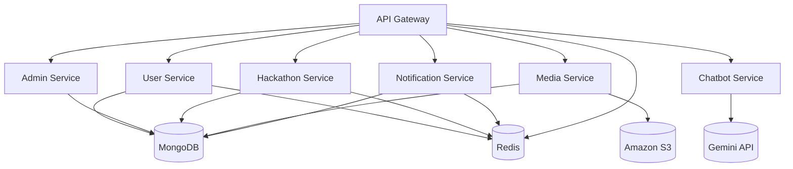
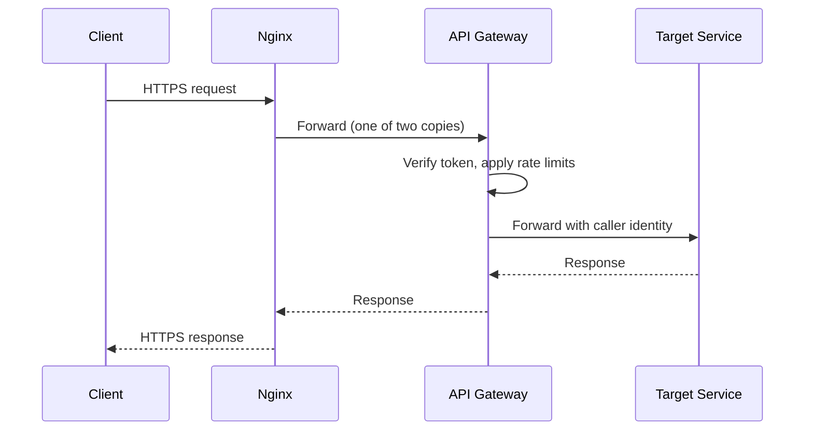

# HackSprint — Services

**Status:** Living document
**Scope:** Service boundaries and responsibilities
**Audience:** Engineers contributing to or operating HackSprint

See also: [`architecture.md`](./architecture.md) for the overall system view and [`api-gateway.md`](./api-gateway.md) for how requests reach these services.

---

## 1. Overview

HackSprint's backend is seven independent Express.js applications: the API Gateway and six services — **User**, **Admin**, **Hackathon**, **Media**, **Notification** and **Chatbot**. Each has its own routes, controllers, models, middleware and business logic, and there is no shared application code between them beyond what each pulls in as its own dependencies. Services communicate over HTTP and all client traffic reaches them through the gateway. Docker Compose runs them as one deployment.

| Service | Port | Gateway prefix | Owns |
|---|---|---|---|
| api-gateway | 5000 | — | routing, identity forwarding, rate limits |
| user-service | 5001 | `/api/auth` | students: login, profiles, people directory, connections, messages |
| hackathon-service | 5002 | `/api/hackathons` | events, registration, teams, submissions, judging, discussions |
| media-service | 5003 | `/api/media` | file uploads to S3 |
| notification-service | 5004 | `/api/notifications` | in-app notifications, email, browser push |
| chatbot-service | 5005 | `/api/chatbot` | the Byte FAQ assistant |
| admin-service | 5006 | `/api/admin` | organisers/admins: login, verification, controller tools, contact + feedback inbox |

MongoDB is shared by every service except the Chatbot Service, which holds no database connection (Section 7). Redis is used by the gateway (rate-limit counters), the User Service (profile and directory cache), the Hackathon Service (event cache, job locks) and the Notification Service (queues). Amazon S3 is used only by the Media Service.

---

## 2. User Service

The User Service is the student side of the platform: authentication, accounts, profiles, and the community features built on them.

**Authentication.** Google sign-in works two ways. The classic flow exchanges an authorization code (`GET /google`). **One Tap / auto sign-in** (`POST /google/one-tap`) takes the Google-signed ID token the browser already holds, so no popup opens: Google's library verifies the token's signature, audience and expiry, the email must be verified, and the same sign-in code then creates or updates the account and issues tokens. Email/password signup, email verification and password reset are also supported. Access tokens are short-lived JWTs paired with a refresh token (`POST /refresh-token`) kept in an httpOnly cookie, stored server-side as a hash.

**Profiles and people directory.** Profiles hold bio, location, skills, education, connected apps and an avatar. The People directory (`/profile/people`, campus view, building lists, stats, suggestions) lists members who left themselves visible. Public profiles are cached in Redis for 30 minutes and **refreshed on every write** (details, username change, education, apps, skills, avatar), with the old key dropped when a username changes; directory lists are cached for 2 minutes. If Redis is down, reads fall through to MongoDB.

**Connections and messages.** A message to someone creates a connection request; replying accepts it, and accepted connections can exchange direct messages (`/connections`, `/messages`). Sending a message accepts an optional `clientId`: a unique index on `(sender, clientId)` makes a retry return the original message (HTTP 200) instead of saving a duplicate (201). That is what lets the frontend queue messages offline and retry safely.

---

## 3. Admin Service

The Admin Service is the organiser side, split out of the Hackathon Service. It has its own login and its own token pair, independent of student sessions.

- **Admin authentication** (`/auth`) — Google login (code flow and One Tap), refresh and logout, with the same access/refresh pattern as students.
- **Profile and verification** — organiser profile, verification requests with supporting documents, and controller approval or rejection.
- **Controller tools** — list and look up admins, delete an admin, search and remove platform users. Removing a user also removes what that user owns (teams, registrations, submissions, votes, reviews, discussion posts), which is why the service carries copies of those schemas.
- **Contact inbox** (`/public/contact`, `/public/feedback`, and for controllers `/enquiries`) — the public Contact and Feedback forms post here. Each submission is stored and every controller is notified (in-app and browser push). Controllers triage from the admin dashboard: status, internal note, reply by email. The public forms have a honeypot field, a per-connection limit and a per-address daily cap.

Admins and students share MongoDB; the Admin Service reads and writes the `admins` collection and the enquiry collection, plus the collections it needs for user removal. It never issues student tokens.

---

## 4. Hackathon Service

The Hackathon Service owns event management: creating, editing and approving events, registrations, teams, submissions, voting, results, judge assignment and discussion threads. It is the single source of truth for what an event is and how participants, teams and judges relate to it.

It still loads the admin record to authorize admin and judge requests (judges authenticate as admins and are scoped to the events they are assigned to), and it keeps the judge routes under `/platform/admin` (assign and remove judges, invitations, submission reviews) because they are tied to events. Admin login, profile, verification and controller tools live in the Admin Service.

**Caching.** The public event list, event by id and by slug, and results are cached in Redis and invalidated whenever an event changes. The list is paginated (page and limit are clamped, limit 1–50) with filters for status, category, difficulty, tag and search.

**Scheduled jobs.** Two in-process `node-cron` jobs run here, not a job queue:

- an hourly sweep for registration and submission phases ending soon, notifying at 24 hours and again at 12 hours out (each milestone tracked separately on the phase, so both fire exactly once);
- a 5-minute sweep for on-spot matches approaching their scheduled time, notifying both teams at 1 hour and 15 minutes out.

Because the service runs as two copies in production, each sweep takes a short Redis lock (`SET NX EX`) so only one copy runs it per tick. If Redis is unreachable the sweep runs anyway — a rare duplicate reminder is better than none.

**Event formats.** The original **submission-based** format (registration, project submission, judging) and **on-spot** events (in-person bracket competitions with no submission) share one `Hackathon` schema distinguished by `eventFormat`, plus a `Match` collection for on-spot scores. On-spot standings are computed on read and are always public.

The service does not store submission files; the Media Service does.

---

## 5. Media Service

The Media Service handles uploads (images, documents, submission files) and the Amazon S3 integration. Binary files live in S3; metadata (filenames, references, ownership) lives in MongoDB, keeping large payloads out of the primary database. Both students and admins can upload; the gateway applies a stricter per-account rate limit to this prefix.

---

## 6. Notification Service

The Notification Service creates and serves in-app notifications, sends transactional email, and delivers browser push. Every other service calls the same `createNotification` entry point, so one change here reaches every notification site at once.

Two things are queued rather than done inline, each on its own BullMQ/Redis queue:

- **Email** — jobs are enqueued (for example the welcome email from the User Service) and a worker sends them through Brevo with Handlebars templates.
- **Push** — every `createNotification` also enqueues a push job. A worker fans it out to each browser the recipient subscribed from (VAPID-signed Web Push, one `PushSubscription` row per device). Expired subscriptions (404/410) are deleted automatically; other failures skip that one device.

Neither email nor push can slow down or fail the request that triggered the notification. The platform rule is that **every in-app notification is also delivered as a browser push**, with an `actionUrl` so a click lands on the right page.

---

## 7. Chatbot Service

The Chatbot Service answers platform FAQ questions through the Byte widget, backed by the Gemini API (`GEMINI_API_KEY`, `GEMINI_MODEL`, default `gemini-3.5-flash`). It holds **no database connection**: it is scoped to never know anything about an individual user's account, registrations, teams or submissions. Each request carries the current message plus the visible conversation history, a fixed system prompt describes the platform, and nothing is stored.

Two endpoints: `POST /chat` returns the whole reply, and `POST /chat/stream` streams it as server-sent events (`data: {"delta": "…"}` chunks, then `{"done": true}`), which is what the widget uses so answers appear as they are written. The first model chunk is read before the `200` is committed, so a failed model call still returns an ordinary JSON error. A transient 503/429 from Gemini is retried once before anything is sent. Replies are written in Markdown and rendered by the frontend. The prompt tells the model to decline account-specific questions and point to the dashboard. A stricter per-IP limit (15 per minute) applies because every request is a billed LLM call.

---

## 8. Service Communication

Services talk over synchronous HTTP, authenticated between themselves with the shared `x-service-secret` / `INTERNAL_SERVICE_SECRET`. Two things are queued instead: transactional email, and push delivery inside the Notification Service. Both are consumed by workers on BullMQ/Redis queues.

---

## 9. Service Isolation and Database Ownership

Each service maps to a business boundary — students, organisers, events, media, notifications, the assistant — kept in separate codebases so the separation is enforced rather than aspirational.

MongoDB is currently **one shared instance**, and the User, Admin and Hackathon services each use the same database. Ownership is still divided by domain: the User Service owns student accounts and community data; the Admin Service owns admin accounts and the contact inbox; the Hackathon Service owns events and everything about participation; the Media Service owns media metadata; the Notification Service owns notifications. "Shared instance" is an infrastructure fact, not a statement about who is responsible for what.

One consequence is worth knowing: a few schemas exist as copies in more than one service (the admin and user schemas are read by the Hackathon Service, and the Admin Service keeps copies of the hackathon-side schemas for user removal). They must be kept in sync by hand when a shared field changes.

---

## 10. Health Endpoints

Every service exposes `GET /health` at its own root (`api-gateway:5000`, `user-service:5001`, `hackathon-service:5002`, `media-service:5003`, `notification-service:5004`, `chatbot-service:5005`, `admin-service:5006`). They are not proxied through the gateway. Docker uses them for container health checks (`docker-compose` `healthcheck`, a `fetch` against `localhost:<port>/health`), nginx waits for a healthy gateway before starting, and Prometheus scrapes each service's `/metrics` over the internal network.

---

## 11. Current Implementation Summary

Seven Express applications — gateway, User, Admin, Hackathon, Media, Notification, Chatbot — over a shared MongoDB, with Redis for caching, rate limits, locks and queues, and S3 for files. The gateway verifies tokens and rate-limits; services authorize. In production the gateway and the Hackathon Service run as two copies each behind Nginx on one EC2 host.

---

## 12. Future Improvements

Planned but **not implemented**:

- removing the per-service token-verification fallback once the gateway is the only entry point
- pagination for the admin dashboard lists (all admins, all events) and per-event participant lists
- a dedicated search service for events, if search load grows
- dedicated databases per service, and an event-driven path between User/Admin/Hackathon data
- circuit breakers and distributed tracing
- more copies of the other services, and a second host with a managed load balancer
- background queues for further workloads such as media processing

---

## 13. Tradeoffs

Splitting into seven services gives clear domain boundaries, independent deploys and a codebase that is easier to hold in your head. It also costs more containers, more deployment units and an extra network hop between components. The shared MongoDB instance means a database outage affects every service except the Chatbot, and the duplicated schemas in Section 9 are a maintenance burden. The admin/user split was done with a shared database on purpose: it separates code, deploys and scaling without the cross-service data problems that separate databases would introduce, and leaves a clear path to separate the data later.
